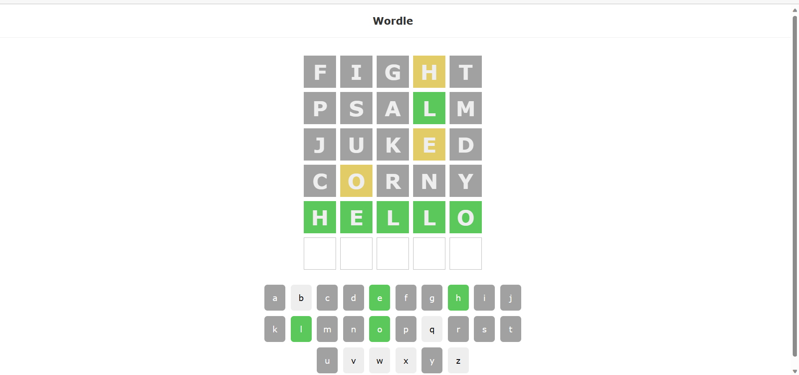

<h1>Wordle Clone</h1>
<h3>Hello, This is a clone of the popular game from New York times called Wordle</h3>

To Use the Code, Follow these steps

<ol>
  <li>Clone the repository in your local system</li> 
  <li>Open a terminal in the root folder of the repository and type   <pre>npm install .</pre>(This will install all the required packages)</li> 
  <li>In the terminal type   <pre>npm run start</pre></li> 
</ol>

